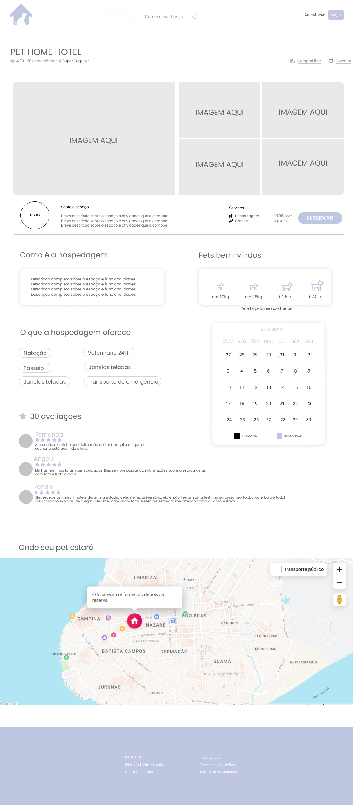
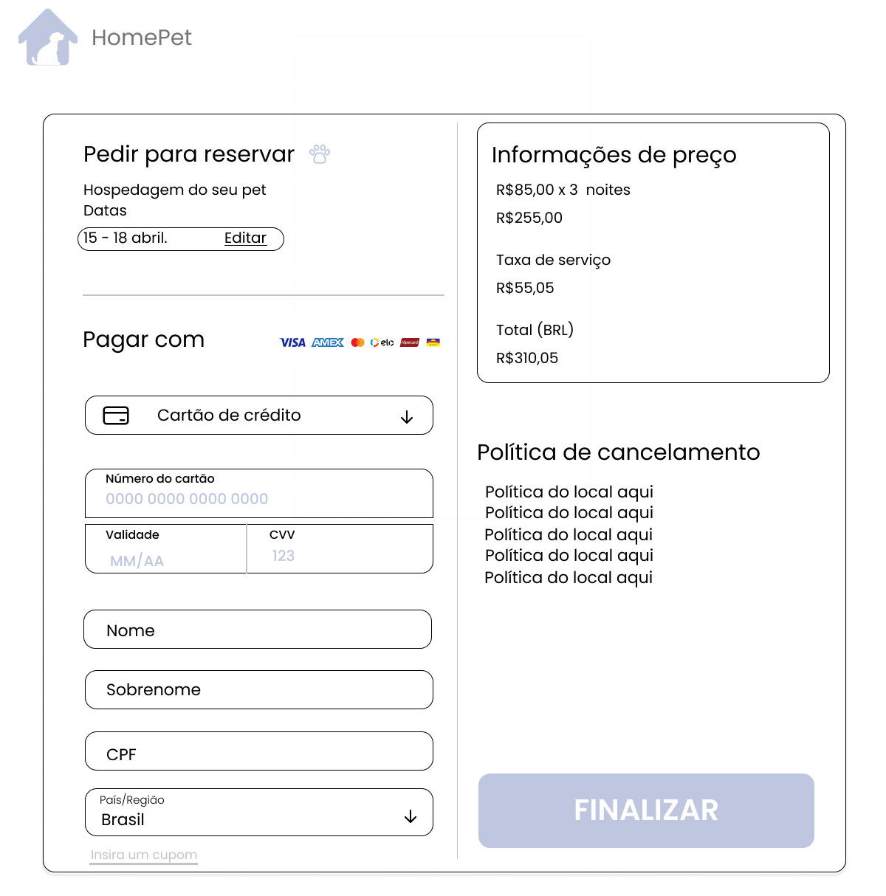

# Projeto de Interface

Pré-requisitos: <a href="2-Especificação do Projeto.md"> Documentação de Especificação</a>

Visão geral da interação do usuário pelas telas do sistema e protótipo interativo das telas com as funcionalidades que fazem parte do sistema (wireframes).

## User Flow

O diagrama apresentado na figura a seguir mostra o fluxo de interação do usuário que deseja buscar e contratar uma hospedagem pelas telas do sistema. As telas deste fluxo são detalhadas na seção de Wireframes que se segue.

## Wireframes

### Tela 01: Página Inicial

### Tela 02: Retorno da Busca de Hospedagens

### Tela 03: Hospedagem Específica

### Tela 04: Login

### Tela 05: Cadastro

### Tela 06: Pagamento

